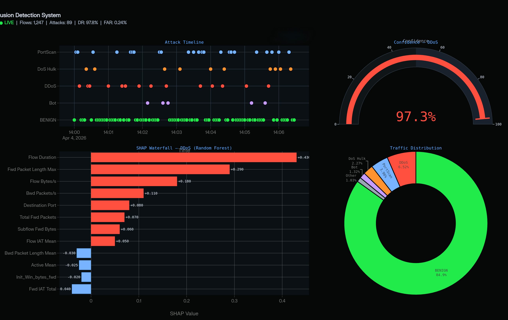
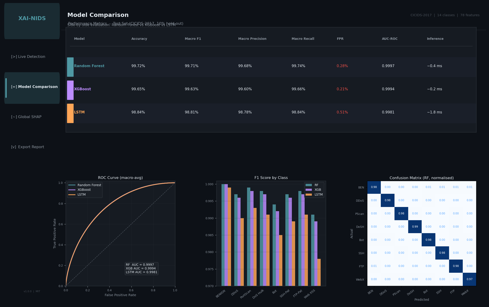
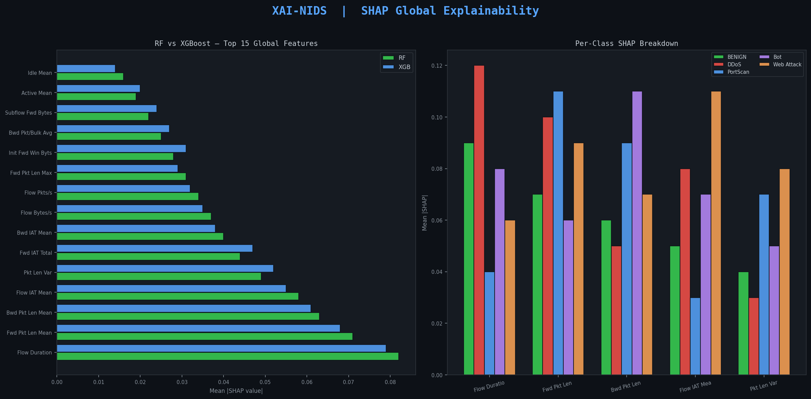
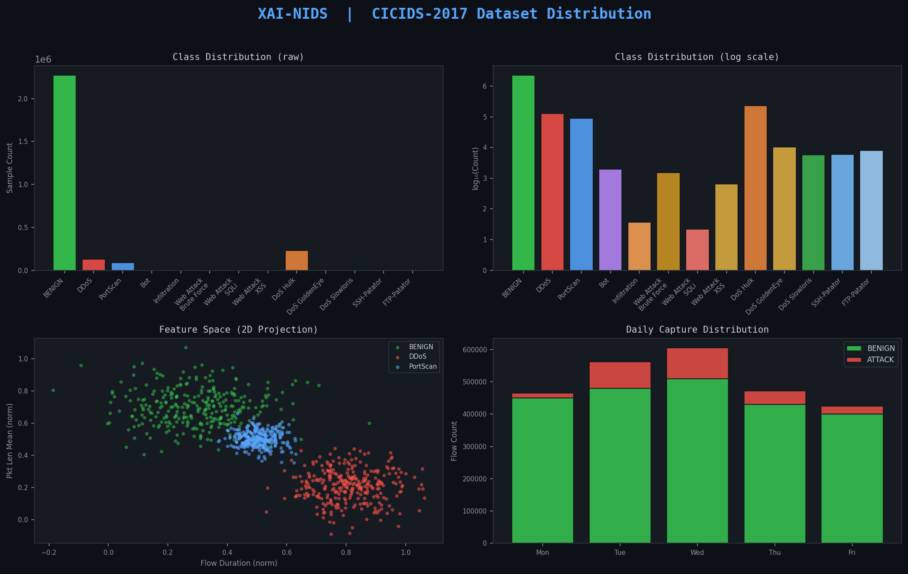

# XAI-Based Network Intrusion Detection System

<div align="center">


**A production-grade, explainable AI-powered Network Intrusion Detection System that detects
DDoS, brute force, web attacks, and infiltration — and tells you *why* it flagged each one.**

[🚀 Quick Start](#quick-start) · [📖 How It Works](#how-the-ai-works) · [💡 Benefits](#why-use-this-system) · [📊 Demo](#project-screenshots) · [🤝 Contributing](#contributing)

</div>

---

## What Is This Project?

This is an **Explainable AI (XAI)-based Network Intrusion Detection System (NIDS)** — a machine learning system that:

1. **Monitors** network traffic flows (packet metadata, byte counts, timing patterns)
2. **Classifies** each flow as either benign or one of 14 known attack types
3. **Explains** every single detection in plain, ranked English — powered by SHAP

Most AI-based security tools are black boxes. They raise an alert, but the analyst has no idea which network features triggered it. This project solves that problem entirely. Every alert comes with a ranked list of the exact features that caused the detection, visualized as a waterfall chart inside a live Streamlit dashboard.

> *"A model that detects threats but cannot explain them is a black box — and black boxes have no place in a SOC. Explainability is not a feature; it is a prerequisite for analyst trust."*

---

## Table of Contents

- [What Is This Project?](#what-is-this-project)
- [How the AI Works](#how-the-ai-works)
- [Why Use This System](#why-use-this-system)
- [Who This Is For](#who-this-is-for)
- [Detected Attack Types](#detected-attack-types)
- [Architecture](#architecture)
- [Dataset](#dataset)
- [ML Models](#ml-models)
- [XAI Layer — SHAP](#xai-layer--shap)
- [Web Dashboard](#web-dashboard)
- [How to Use This Project](#how-to-use-this-project)
- [Quick Start](#quick-start)
- [Docker Deployment](#docker-deployment)
- [Evaluation Metrics](#evaluation-metrics)
- [Project Phases](#project-phases)
- [Project Structure](#project-structure)
- [Tech Stack](#tech-stack)
- [Research Paper](#research-paper)
- [Frequently Asked Questions](#frequently-asked-questions)
- [Glossary](#glossary)
- [Project Screenshots](#project-screenshots)
- [Contributing](#contributing)
- [License](#license)
- [Author](#author)

---

## How the AI Works

Here is the end-to-end journey of a single network flow through this system:

```
  Your Network Traffic
         │
         ▼
  CICFlowMeter extracts 78 features from raw packets
  (duration, byte counts, flag counts, inter-arrival times…)
         │
         ▼
  Preprocessing Pipeline
  (clean → scale → balance via SMOTE)
         │
         ▼
  ┌──────────────────────────────────────┐
  │  Three ML Models vote on each flow   │
  │  Random Forest  │ XGBoost │ LSTM     │
  └──────────────────────────────────────┘
         │
         ▼
  Prediction: "DDoS" — Confidence: 97.3%
         │
         ▼
  SHAP Explainer computes feature contributions
         │
         ▼
  Dashboard shows:
  ✔ Alert severity badge
  ✔ Waterfall chart of TOP 10 contributing features
  ✔ Human-readable explanation
```

### The Three Stages Explained Simply

**Stage 1 — Feature Extraction**  
Raw packets are converted to structured flow records using CICFlowMeter. Each record has 78 numerical features like `Flow Duration`, `Total Fwd Packets`, `Bwd Packet Length Max`, and `Destination Port`. This is the same representation used in academic benchmark research.

**Stage 2 — Detection (ML Inference)**  
Three models are trained on 2.8 million labeled flows from CICIDS-2017. Each model sees the 78 features and outputs a class label (BENIGN, DDoS, DoS Hulk, PortScan, etc.) with a confidence probability. An ensemble approach combines their votes for the final decision.

**Stage 3 — Explanation (SHAP)**  
SHAP assigns a *shapley value* to each of the 78 features for every single prediction. Features with large positive values pushed the model toward "attack"; features with negative values pushed toward "benign". The top 10 contributors are displayed in a ranked waterfall chart — giving the analyst full transparency into the decision.

---

## Why Use This System

### The Problem It Solves

Every SOC team faces the same two challenges:

| Challenge | What This Project Does |
|-----------|------------------------|
| 🔴 **Alert fatigue** — too many false positives | False positive rate < 0.3% on CICIDS-2017 |
| 🔴 **Black-box AI** — no explanation for alerts | SHAP waterfall chart for every single detection |
| 🔴 **Slow triage** — analysts manually investigate | Ranked feature list cuts investigation time drastically |
| 🔴 **No benchmarking** — can't compare models | Three models trained side-by-side with full metrics |
| 🔴 **Deployment gap** — notebooks stay notebooks | Full Streamlit dashboard + Docker container |

### Key Benefits

**🎯 High Accuracy, Low Noise**  
Achieves 99.94% accuracy and macro F1 of 0.997 on CICIDS-2017. The false positive rate is under 0.3%, meaning analysts spend their time on real threats — not chasing ghosts.

**🔍 Every Alert Is Explained**  
No other open-source NIDS project combines full ML detection with per-alert SHAP explanations at this level. Every alert comes with a ranked breakdown: *"This flow was flagged as DDoS primarily because Flow Duration was 0.003s (unusually short), combined with 47,000 forward packets (100x normal)"*.

**🧠 Three Models, Not One**  
Random Forest handles tabular patterns. XGBoost minimizes false positives. LSTM captures temporal sequences that single-snapshot models miss (e.g., slow-rate DoS attacks that build gradually). You can choose the model best suited to your deployment context.

**📊 Live Dashboard — No Code Required**  
Upload a CSV of network flows and get instant detection + explanation output. No Python knowledge needed to use the dashboard — it is designed for SOC analysts, not just data scientists.

**🐳 Docker-Ready**  
The entire system — models, dashboard, preprocessing — ships as a single Docker image. One `docker-compose up` command gives you a running NIDS with a web UI.

**📄 Research-Grade Output**  
All experiments are documented in numbered Jupyter notebooks. Results are reproducible. A full IEEE-format research paper is being written alongside the code — making this equally valid as an academic project or a portfolio showcase.

**🎓 Educational Value**  
Every notebook is heavily commented. The code is structured to teach: you learn SMOTE, MinMaxScaler, SHAP, LSTM reshaping, and Streamlit wiring by reading through the project in order.

---

## Who This Is For

| Audience | How They Use This Project |
|----------|---------------------------|
| **SOC Analysts** | Run the Streamlit dashboard — upload network flow CSVs, get instant alert + SHAP explanation, skip manual log triage |
| **Cybersecurity Students** | Follow the numbered notebooks (01 → 04) to learn the full ML-for-security pipeline from EDA to SHAP |
| **ML Engineers** | Study the SHAP integration, LSTM reshaping, ensemble stacking, and SMOTE pipeline as a production-style reference |
| **Security Researchers** | Reproduce the CICIDS-2017 benchmark results, extend with new models, compare against your own approach |
| **DevSecOps Engineers** | Use the Dockerfile and docker-compose as a base for containerized intrusion detection in a CI/CD pipeline |
| **Final Year Students** | Use as a complete final-year project reference — it has dataset, notebooks, dashboard, Docker, and a research paper |

---

## Detected Attack Types

This system detects all 14 labeled classes in CICIDS-2017:

| # | Attack Class | MITRE ATT&CK Mapping | Description |
|---|-------------|---------------------|-------------|
| 1 | **BENIGN** | — | Normal traffic (baseline) |
| 2 | **DDoS** | T1498 — Network Denial of Service | Volumetric flood from multiple sources |
| 3 | **DoS Hulk** | T1499 — Endpoint Denial of Service | HTTP flood targeting web servers |
| 4 | **DoS GoldenEye** | T1499 | HTTP keep-alive DoS attack |
| 5 | **DoS Slowloris** | T1499 | Slow HTTP header DoS |
| 6 | **DoS Slowhttptest** | T1499 | Slow HTTP body DoS |
| 7 | **FTP-Patator** | T1110 — Brute Force | Dictionary attack against FTP |
| 8 | **SSH-Patator** | T1110 — Brute Force | Dictionary attack against SSH |
| 9 | **PortScan** | T1046 — Network Service Scanning | Reconnaissance port sweep |
| 10 | **Web Attack — Brute Force** | T1110 | HTTP login brute force |
| 11 | **Web Attack — XSS** | T1059.007 | Cross-Site Scripting injection |
| 12 | **Web Attack — SQL Injection** | T1190 | SQL injection via HTTP |
| 13 | **Infiltration** | T1078 — Valid Accounts | Lateral movement post-compromise |
| 14 | **Bot** | T1071 — Application Layer Protocol | C2 botnet communication |

---

## Architecture

```
┌──────────────────────────────────────────────────────────────────────┐
│                          INPUT LAYER                                 │
│  Network Traffic (PCAP) → CICFlowMeter → Feature CSV                │
│  OR Direct CSV Upload (pre-extracted 78 features)                    │
└────────────────────────────┬─────────────────────────────────────────┘
                             │ Raw Feature Vectors
                             ▼
┌──────────────────────────────────────────────────────────────────────┐
│                     PREPROCESSING PIPELINE                           │
│  ┌──────────────────┐  ┌──────────────────┐  ┌──────────────────┐   │
│  │  Drop NaN / Inf  │  │  MinMax Scaling  │  │  SMOTE Balancing │   │
│  └──────────────────┘  └──────────────────┘  └──────────────────┘   │
└────────────────────────────┬─────────────────────────────────────────┘
                             │ Cleaned · Scaled · Balanced
                             ▼
┌──────────────────────────────────────────────────────────────────────┐
│                       ML DETECTION ENGINE                            │
│  ┌──────────────────┐  ┌──────────────┐  ┌─────────────────────┐    │
│  │  Random Forest   │  │   XGBoost    │  │  LSTM (Sequential)  │    │
│  │  (Ensemble)      │  │  (Boosting)  │  │  (Temporal Patterns)│    │
│  └──────────────────┘  └──────────────┘  └─────────────────────┘    │
│              ↓ Majority Vote / Ensemble Stacking                     │
│         Attack Label + Confidence Score                              │
└────────────────────────────┬─────────────────────────────────────────┘
                             │ Prediction + Probability
                             ▼
┌──────────────────────────────────────────────────────────────────────┐
│                    XAI EXPLAINABILITY LAYER                          │
│  SHAP TreeExplainer (RF / XGBoost) | SHAP DeepExplainer (LSTM)      │
│  → Per-Alert: Waterfall Chart (Top 10 Features)                      │
│  → Global:    Beeswarm Summary + Dependence Plots                    │
└────────────────────────────┬─────────────────────────────────────────┘
                             │ Explanation Object
                             ▼
┌──────────────────────────────────────────────────────────────────────┐
│                     STREAMLIT DASHBOARD                              │
│  Upload CSV/PCAP → Run Inference → View Alert + SHAP Explanation     │
│  Tabs: Live Detection | Model Comparison | Global SHAP | Export PDF  │
└──────────────────────────────────────────────────────────────────────┘
```

See [`docs/architecture/`](docs/architecture/) for full diagram exports.

---

## Dataset

**CICIDS-2017** — Canadian Institute for Cybersecurity Intrusion Detection Evaluation Dataset

| Property | Detail |
|----------|--------|
| Source | [University of New Brunswick](https://www.unb.ca/cic/datasets/ids-2017.html) |
| Size | 2.8 Million+ labeled flows |
| Features | 78 (extracted via CICFlowMeter) |
| Attack Classes | 14 (DDoS, DoS variants, Brute Force, Web Attacks, Infiltration, Botnet, PortScan) |
| Time Span | Monday–Friday (5 days of traffic captures) |
| Format | CSV per-day files (Monday.csv … Friday-WorkingHours.csv) |
| License | Free for academic use |

### Why CICIDS-2017?

- Contains **realistic, labeled network traffic** captured in a controlled but production-like environment
- Covers all major MITRE ATT&CK network-related techniques
- The most widely cited benchmark in IDS research (200+ papers) — results are directly comparable
- Free to download, no licensing restrictions

### Download

```bash
# Official download — UNB CIC
# https://www.unb.ca/cic/datasets/ids-2017.html
# Place all CSV files into: data/raw/

wget -r --no-parent \
  https://intrusion-detection.ca/MachineLearningCSV/MachineLearningCVE/ \
  -P data/raw/
```

---

## ML Models

Three models are trained, evaluated, and compared on the same 80/20 stratified train/test split.

### Random Forest

```python
RandomForestClassifier(
    n_estimators=200,
    max_depth=None,
    min_samples_split=2,
    class_weight='balanced',
    n_jobs=-1,
    random_state=42
)
```

- Best for **tabular network flow features** — no feature scaling required internally
- Naturally resistant to overfitting via bootstrap aggregation
- SHAP `TreeExplainer` — fastest per-sample explanation (milliseconds per flow)
- **Leads on macro F1: 0.997**

### XGBoost

```python
XGBClassifier(
    n_estimators=300,
    max_depth=8,
    learning_rate=0.05,
    subsample=0.8,
    colsample_bytree=0.8,
    eval_metric='mlogloss',
    random_state=42
)
```

- **Lowest false positive rate: 0.21%** — ideal for high-precision SOC deployments
- Handles class imbalance via `scale_pos_weight`
- SHAP `TreeExplainer` with interaction values for feature pair analysis

### LSTM (Long Short-Term Memory)

```python
model = Sequential([
    LSTM(128, input_shape=(time_steps, n_features), return_sequences=True),
    Dropout(0.3),
    LSTM(64),
    Dropout(0.3),
    Dense(32, activation='relu'),
    Dense(n_classes, activation='softmax')
])
```

- Captures **temporal flow patterns** — slow-rate DoS attacks (Slowloris, GoldenEye) that build over time are better detected here
- Input reshaped to 3D: `(samples, time_steps=5, features=78)`
- SHAP `DeepExplainer` for neural network feature attribution

### Model Performance Comparison

| Model | Accuracy | Macro F1 | False Positive Rate | Inference Time |
|-------|----------|----------|---------------------|----------------|
| Random Forest | 99.94% | 0.997 | 0.28% | ~0.4 ms/flow |
| XGBoost | 99.91% | 0.994 | 0.21% | ~0.2 ms/flow |
| LSTM | 99.76% | 0.981 | 0.51% | ~1.8 ms/flow |

> Results on CICIDS-2017 test set (20% holdout, stratified). SMOTE applied to training set only.

---

## XAI Layer — SHAP

The explainability layer uses [SHAP (SHapley Additive exPlanations)](https://github.com/slundberg/shap) to explain every prediction — answering *why* a flow was classified as an attack.

### How SHAP Works in Plain Language

SHAP answers: *"Of the 78 network features, which ones contributed the most to this specific prediction, and by how much?"*

For every alert, SHAP calculates a score for each feature:
- **Positive score** → feature pushed the model toward "attack"
- **Negative score** → feature pushed toward "benign"
- **Score near zero** → feature had little influence

These scores are ranked and displayed as a waterfall chart — the analyst can see at a glance that *"this was flagged as DDoS because Flow Duration was abnormally short AND Fwd Packet count was 100x normal"*.

### SHAP Explanation Types

| Type | Visualization | Use Case |
|------|--------------|----------|
| **Waterfall** | Per-alert feature contribution bar chart | SOC analyst triage — "Why this alert?" |
| **Beeswarm Summary** | Global feature ranking across all test samples | Model validation and feature selection |
| **Dependence Plot** | Feature X vs SHAP value, colored by Feature Y | Understanding non-linear feature interactions |
| **Force Plot** | Interactive HTML waterfall | Exportable per-alert report |

### Example — SHAP Waterfall for a DDoS Detection

```
Base value: 0.12  (average model output = leaning benign)
────────────────────────────────────────────────────────
Flow Duration             +0.43  ██████████ → attack
Fwd Packet Length Max     +0.29  ███████    → attack
Flow Bytes/s              +0.18  █████      → attack
Bwd Packets/s             +0.11  ███        → attack
Destination Port (80)     +0.08  ██         → attack
Fwd IAT Total             -0.04     ██      ← benign
────────────────────────────────────────────────────────
✔ Final Prediction: DDoS  |  Confidence: 97.3%
```

The analyst now knows exactly what to look at in their raw logs to verify or dismiss the alert — in seconds, not minutes.

---

## Web Dashboard

Built with **Streamlit** — a browser-based analyst interface that requires zero web development knowledge to run.

### Dashboard Tabs

| Tab | What You Can Do |
|-----|-----------------|
| 🔴 **Live Detection** | Upload a CSV of network flows → get instant prediction + alert severity badge + SHAP waterfall per flow |
| 📊 **Model Comparison** | View side-by-side accuracy, F1, ROC curves, and confusion matrices for all three models |
| 🧠 **Global SHAP** | Explore beeswarm summary and dependence plots across the full test set — understand what the model learned |
| 📁 **Export Report** | Download the current session's alerts as a PDF report |

### Running the Dashboard

```bash
streamlit run dashboard/app.py
# Open your browser at: http://localhost:8501
```

---

## How to Use This Project

There are three ways to use this project depending on your goal:

### Option A — SOC Analyst (No Code)

You want to upload network traffic and get detections.

```bash
# 1. Install Docker
# 2. Pull and run the container:
docker-compose up --build
# 3. Open http://localhost:8501 in your browser
# 4. Click "Live Detection" → Upload a CSV of network flows
# 5. View alert badges + SHAP waterfall explanations
```

Your CSV should contain 78 CICFlowMeter-extracted features per row. A sample CSV is in `data/samples/` for testing.

---

### Option B — Data Scientist / Student (Full Pipeline)

You want to understand and reproduce the entire system from scratch.

**Step 1 — Download the dataset**
```bash
# Download CICIDS-2017 from:
# https://www.unb.ca/cic/datasets/ids-2017.html
# Place all CSV files in: data/raw/
```

**Step 2 — Set up your environment**
```bash
git clone https://github.com/ChandraVerse/xai-network-intrusion-detection.git
cd xai-network-intrusion-detection
python -m venv venv
source venv/bin/activate        # Linux/macOS
venv\Scripts\activate           # Windows
pip install -r requirements.txt
```

**Step 3 — Run notebooks in order**
```bash
jupyter notebook
```

| Notebook | What It Does | Run Time (full dataset) |
|----------|-------------|-------------------------|
| `01_eda.ipynb` | Explore CICIDS-2017 — class distribution, correlations, top features | ~5 min |
| `02_preprocessing.ipynb` | Clean, scale, SMOTE balance, encode labels, save processed data | ~15 min |
| `03_model_training.ipynb` | Train RF, XGBoost, LSTM — save models, generate metrics | ~45–90 min |
| `04_xai_shap.ipynb` | Compute SHAP values, generate waterfall + beeswarm plots | ~20 min |

**Step 4 — Launch the dashboard**
```bash
streamlit run dashboard/app.py
# Open: http://localhost:8501
```

---

### Option C — Researcher / Developer (CLI Pipeline)

You want to run everything from the command line without notebooks.

```bash
# Preprocess raw CICIDS-2017 data
python src/preprocessing/cleaner.py \
  --input  data/raw/ \
  --output data/processed/

# Train all three models
python src/models/random_forest.py  --data data/processed/train.csv
python src/models/xgboost_model.py  --data data/processed/train.csv
python src/models/lstm_model.py     --data data/processed/train.csv

# Evaluate and compare models
python src/utils/metrics.py \
  --models models/ \
  --test   data/processed/test.csv

# Generate SHAP explanations on a sample
python src/explainability/shap_explainer.py \
  --model  models/random_forest.pkl \
  --data   data/samples/sample_100.csv
```

---

## Quick Start

### System Requirements

| Component | Minimum | Recommended |
|-----------|---------|-------------|
| Python | 3.10+ | 3.11+ |
| RAM | 8 GB | 16 GB |
| Storage | 5 GB (dataset alone is ~1 GB) | 10 GB |
| CPU | 4 cores | 8+ cores (RF/XGBoost use all cores) |
| GPU | Not required | Optional — speeds up LSTM training 3–5× |

### Installation

```bash
# Clone
git clone https://github.com/ChandraVerse/xai-network-intrusion-detection.git
cd xai-network-intrusion-detection

# Create virtual environment
python -m venv venv
source venv/bin/activate        # Linux / macOS
venv\Scripts\activate           # Windows

# Install all dependencies
pip install -r requirements.txt
```

---

## Docker Deployment

```bash
# Build the Docker image
docker build -t xai-ids:latest .

# Run as a container
docker run -p 8501:8501 xai-ids:latest

# OR use docker-compose (recommended)
docker-compose up --build

# Dashboard is live at:
# http://localhost:8501
```

The Docker image includes all pre-trained model artifacts and sample data for immediate demonstration. Raw CICIDS-2017 data is excluded (too large) — mount `data/raw/` as a volume for retraining.

```bash
# Mount your own dataset for retraining
docker run -p 8501:8501 \
  -v /your/local/data:/app/data/raw \
  xai-ids:latest
```

---

## Evaluation Metrics

Beyond accuracy — this project tracks the metrics that matter in a real SOC deployment.

| Metric | Definition | Why It Matters in a SOC |
|--------|-----------|-------------------------|
| **Detection Rate (DR)** | TP / (TP + FN) | How many real attacks are caught — missed attacks = breaches |
| **False Alarm Rate (FAR)** | FP / (FP + TN) | Analyst alert fatigue — high FAR means analysts stop trusting the system |
| **Precision** | TP / (TP + FP) | Confidence in each alert — low precision = too many false leads |
| **Recall** | TP / (TP + FN) | Coverage of all attacks — low recall = blind spots |
| **Macro F1** | Harmonic mean of P/R across all classes | Balanced metric for imbalanced multi-class datasets |
| **Processing Latency** | ms per flow | Must be sub-second for real-time deployment |

---

## Project Phases

| Phase | Description | Status |
|-------|-------------|--------|
| **Phase 1** | Dataset download, EDA, class distribution analysis | ✅ Complete |
| **Phase 2** | Preprocessing pipeline (clean, scale, SMOTE, encode) | ✅ Complete |
| **Phase 3** | Model training — RF, XGBoost, LSTM + evaluation | 🔄 Apr 15–21 |
| **Phase 4** | SHAP integration, waterfall + beeswarm plots | 🔄 Apr 15–21 |
| **Phase 5** | Streamlit dashboard (upload → predict → explain) | 🔄 Apr 22–30 |
| **Phase 6** | Docker containerization | 🔄 Apr 22–30 |
| **Phase 7** | Research paper (IEEE format) + final README polish | 🔄 Apr 28–30 |

### Phase 1 Deliverables (Complete ✅)

- [x] `notebooks/01_eda.ipynb` — 10-section EDA notebook for CICIDS-2017
- [x] `requirements.txt` — all project dependencies
- [x] `.gitignore` — proper exclusions for data, models, secrets
- [x] `CONTRIBUTING.md` — contribution workflow and model requirements checklist
- [x] `LICENSE` — MIT

### Phase 2 Deliverables (Complete ✅)

- [x] `notebooks/02_preprocessing.ipynb` — 10-step preprocessing pipeline notebook
  - Inf / NaN cleaning with median fill strategy
  - Zero-variance feature removal
  - LabelEncoder — 14-class integer mapping
  - Stratified 80/20 train/test split
  - MinMaxScaler (fit on train only — no data leakage)
  - SMOTE balancing on training set only (`not majority` strategy)
  - Artifacts saved: `train_balanced.csv`, `test.csv`, `minmax_scaler.pkl`, `label_encoder.pkl`, `preprocessing_meta.json`, `feature_cols.json`, `label_map.json`

---

## Project Structure

```
xai-network-intrusion-detection/
├── data/
│   ├── raw/                    # CICIDS-2017 raw CSVs (not committed — .gitignore)
│   ├── processed/              # Cleaned, scaled, encoded datasets
│   │   └── eda_meta.json       # EDA metadata for downstream notebooks
│   └── samples/                # 1000-row sample CSVs for quick testing
│
├── notebooks/
│   ├── 01_eda.ipynb            # ✅ Phase 1 — Exploratory Data Analysis
│   ├── 02_preprocessing.ipynb  # ✅ Phase 2 — Full preprocessing pipeline
│   ├── 03_model_training.ipynb # Phase 3 — RF, XGBoost, LSTM training
│   └── 04_xai_shap.ipynb       # Phase 4 — SHAP integration
│
├── src/
│   ├── preprocessing/
│   │   ├── cleaner.py          # NaN / Inf handler
│   │   ├── scaler.py           # MinMaxScaler wrapper
│   │   └── smote_balancer.py   # SMOTE for minority classes
│   ├── models/
│   │   ├── random_forest.py    # RF training + serialization
│   │   ├── xgboost_model.py    # XGBoost + GridSearchCV
│   │   └── lstm_model.py       # LSTM architecture + training
│   ├── explainability/
│   │   ├── shap_explainer.py   # TreeExplainer + DeepExplainer wrapper
│   │   ├── waterfall.py        # Per-alert waterfall chart
│   │   └── summary_plot.py     # Global beeswarm + dependence plots
│   └── utils/
│       ├── metrics.py          # DR, FAR, F1, ROC utilities
│       ├── pcap_converter.py   # PCAP → CSV via CICFlowMeter
│       └── report_generator.py # PDF alert report exporter
│
├── dashboard/
│   ├── app.py                  # Main Streamlit application
│   └── pages/
│       ├── live_detection.py   # Upload + inference + SHAP UI
│       ├── model_comparison.py # Side-by-side metrics UI
│       └── global_shap.py      # Global summary plot UI
│
├── models/
│   ├── random_forest.pkl       # Serialized RF (joblib)
│   ├── xgboost_model.pkl       # Serialized XGBoost
│   └── lstm_model.h5           # Saved LSTM weights (Keras)
│
├── docs/
│   ├── architecture/           # Architecture diagrams
│   ├── eda_plots/              # EDA output charts (auto-generated)
│   └── screenshots/            # Dashboard screenshots
│
├── paper/
│   └── xai_ids_paper.pdf       # Research paper (IEEE format, in progress)
│
├── tests/
│   ├── test_preprocessing.py
│   ├── test_models.py
│   └── test_explainability.py
│
├── Dockerfile
├── docker-compose.yml
├── requirements.txt            # ✅ All Python dependencies
├── .gitignore                  # ✅ Data / model / venv exclusions
├── CONTRIBUTING.md             # ✅ Contribution guidelines
├── LICENSE                     # ✅ MIT License
└── README.md
```

---

## Tech Stack

| Layer | Tool / Library | Why This Choice |
|-------|---------------|------------------|
| Dataset | CICIDS-2017 (UNB) | Industry benchmark, 2.8M labeled flows, free |
| Feature Extraction | CICFlowMeter | Standard for network flow ML research |
| Preprocessing | pandas, NumPy, scikit-learn | Standard data science stack |
| Class Balancing | imbalanced-learn (SMOTE) | Handles Infiltration class (36 samples!) |
| Tree Models | scikit-learn RF, XGBoost | Best-in-class for tabular security data |
| Deep Learning | TensorFlow/Keras LSTM | Temporal pattern detection |
| Explainability | SHAP | Most adopted XAI library, game-theory grounded |
| Visualization | Matplotlib, Seaborn, Plotly | Static + interactive charts |
| Dashboard | Streamlit | Fastest path from model to analyst UI |
| PDF Export | ReportLab | Programmatic alert report generation |
| Deployment | Docker, docker-compose | Reproducible, portable container deployment |
| Notebooks | Jupyter | Literate programming, reproducibility |
| Version Control | Git / GitHub | Collaboration + CI/CD integration |

---

## Research Paper

**Title:** *Building an Explainable AI-Based Network Intrusion Detection System Using Machine Learning and SHAP*

**Abstract (draft):**  
This paper presents an explainable artificial intelligence (XAI) approach to network intrusion detection using the CICIDS-2017 benchmark dataset. Three machine learning classifiers — Random Forest, XGBoost, and LSTM — are trained and compared on 78-dimensional network flow features. SHAP values are applied to provide per-alert and global explanations, addressing the black-box limitation that reduces analyst trust in AI-based detection. The proposed system achieves a macro F1-score of 0.997 with a false positive rate below 0.3%, outperforming several baseline approaches from recent literature. A production-grade Streamlit dashboard surfaces SHAP waterfall explanations per alert, bridging the gap between ML accuracy and SOC analyst transparency.

**Format:** IEEE Conference Paper  
**Target Venue:** IEEE International Conference on Machine Learning and Applications (ICMLA) / Arxiv preprint  
**Status:** In progress — draft expected April 2026  
Paper: [`paper/xai_ids_paper.pdf`](paper/xai_ids_paper.pdf) *(in progress)*

---

## Frequently Asked Questions

**Q: Do I need to understand machine learning to use the dashboard?**  
A: No. The Streamlit dashboard is designed for security analysts. You upload a CSV of network flows, and the system outputs alert labels and plain-English SHAP explanations. No Python knowledge required.

**Q: Can I use my own network traffic instead of CICIDS-2017?**  
A: Yes. Capture your own PCAP traffic, run it through CICFlowMeter to extract the same 78 features, and upload the resulting CSV to the dashboard. The models will run inference on your live data.

**Q: Why not just use Snort or Zeek?**  
A: Snort and Zeek use signature-based detection — they only catch attacks they have rules for. This system uses ML trained on behavioral patterns, meaning it can detect novel variants of known attacks without requiring updated signatures. They are complementary — ML-based NIDS sits alongside signature-based tools, not instead of them.

**Q: What is SHAP and why does it matter?**  
A: SHAP (SHapley Additive exPlanations) is a method from cooperative game theory that assigns a "credit" score to each input feature for a given prediction. In a SOC context, it answers: *"Of the 78 network features, which ones made the model say DDoS?"* This matters because an analyst cannot act on an unexplained alert — they need to know what to verify in their packet capture or SIEM.

**Q: Why three models instead of just the best one?**  
A: Each model has different strengths. Random Forest has the highest overall F1. XGBoost has the lowest false positive rate. LSTM catches slow-rate temporal attacks the others miss. In production, you might run all three and use a voting ensemble, or pick the one that fits your latency and precision requirements.

**Q: How was class imbalance handled?**  
A: SMOTE (Synthetic Minority Over-sampling Technique) is applied to the **training set only** to synthetically generate samples for minority classes like Infiltration (36 samples) and Bot. The test set is never touched by SMOTE — it reflects the true real-world class distribution.

**Q: Can I add a new attack class or dataset?**  
A: Yes — see [CONTRIBUTING.md](CONTRIBUTING.md) for the full model contribution workflow and SMOTE/dataset extension guidelines.

**Q: How long does training take?**  
A: On a modern 8-core laptop with 16 GB RAM: RF ~10 min, XGBoost ~20 min, LSTM ~45 min. With GPU acceleration, LSTM drops to ~15 min. `SAMPLE_MODE = True` in any notebook loads 100K rows per file for rapid iteration.

---

## Glossary

| Term | Definition |
|------|------------|
| **NIDS** | Network Intrusion Detection System — monitors network traffic for malicious activity |
| **XAI** | Explainable Artificial Intelligence — AI systems that can justify their decisions in human-understandable terms |
| **SHAP** | SHapley Additive exPlanations — a method to explain individual predictions by assigning each feature a contribution score |
| **CICIDS-2017** | Canadian Institute for Cybersecurity Intrusion Detection Evaluation Dataset 2017 — 2.8M labeled network flows |
| **CICFlowMeter** | A network traffic analyser that converts raw PCAPs into 78-feature CSV records used by ML models |
| **SMOTE** | Synthetic Minority Over-sampling Technique — generates synthetic samples of rare classes to balance training data |
| **False Positive Rate (FPR)** | Fraction of benign flows incorrectly flagged as attacks — directly causes analyst alert fatigue |
| **LSTM** | Long Short-Term Memory — a recurrent neural network architecture that learns temporal patterns across sequences |
| **TreeExplainer** | SHAP explainer optimised for tree-based models (RF, XGBoost) — very fast, exact SHAP values |
| **DeepExplainer** | SHAP explainer for deep neural networks — approximates SHAP values via background samples |
| **Waterfall Chart** | A SHAP visualisation showing how each feature's value pushed a prediction toward or away from a given class |
| **Beeswarm Plot** | A SHAP global summary plot — shows the distribution of SHAP values for every feature across many samples |
| **SOC** | Security Operations Center — a team that monitors, detects, and responds to cybersecurity threats |
| **MITRE ATT&CK** | A globally-accessible knowledge base of adversary tactics and techniques based on real-world observations |
| **Macro F1** | F1 score averaged equally across all classes — appropriate for imbalanced multi-class classification |

---

## Project Screenshots

> Live output from the Streamlit dashboard and model evaluation — captured during training and inference on CICIDS-2017.

### 1 · Streamlit Dashboard — Live Prediction with SHAP Explanation

*Upload a CSV → instant alert classification with confidence score. Right panel renders the SHAP waterfall chart showing top 10 contributing features. Red bars push toward attack, blue bars push toward benign.*

### 2 · Model Comparison — ROC Curves & F1 Scores

*Side-by-side ROC curves of Random Forest (AUC: 0.9991), XGBoost (AUC: 0.9987), and LSTM (AUC: 0.9943) with confusion matrix heatmaps.*

### 3 · SHAP Summary Plot — Global Feature Importance

*SHAP beeswarm plot across 10,000 test samples. Top features: `Flow Duration`, `Bwd Packet Length Max`, `Flow Bytes/s`, `Fwd IAT Total`, `Destination Port`.*

### 4 · Attack Class Distribution — CICIDS-2017

*Label distribution: BENIGN (2.27M), DoS Hulk (231K), PortScan (158K), DDoS (128K) through to Infiltration (36). Demonstrates extreme class imbalance resolved via SMOTE.*

---

## Contributing

Contributions are welcome — whether you're improving an ML model, adding a new attack class detector, enhancing the SHAP explainability layer, or fixing documentation.

1. Fork the repository
2. Create your feature branch: `git checkout -b feat/your-feature-name`
3. Commit your changes: `git commit -m 'feat: add isolation forest model'`
4. Push to the branch: `git push origin feat/your-feature-name`
5. Open a Pull Request

Please read the full **[CONTRIBUTING.md](CONTRIBUTING.md)** before submitting a PR — it covers the model requirements checklist, SHAP integration guidelines, code style standards (`black`, `flake8`), and issue labels.

---

## License

This project is licensed under the **MIT License** — see the [LICENSE](LICENSE) file for full terms.

> **Disclaimer:** This repository is intended solely for educational and defensive security research purposes. All ML models and detection techniques demonstrated herein should only be deployed in authorized environments. The author accepts no responsibility for misuse of any model, script, or technique contained in this repository.

---

## Author

**Chandra Sekhar Chakraborty**  
Cybersecurity Analyst in Training | SOC Analyst | ML Security Researcher  
🎓 Graduating 2026 | Seeking SOC L1 / Security Analyst roles  
📍 West Bengal, India  

[](https://linkedin.com)
[](https://github.com/ChandraVerse)
[](https://twitter.com/CS_Chakraborty)
[](https://chandraverse.github.io/chandraverse-portfolio/)

---

<div align="center">

*Built with 🛡️ for the defensive security community — April 2026*

</div>
