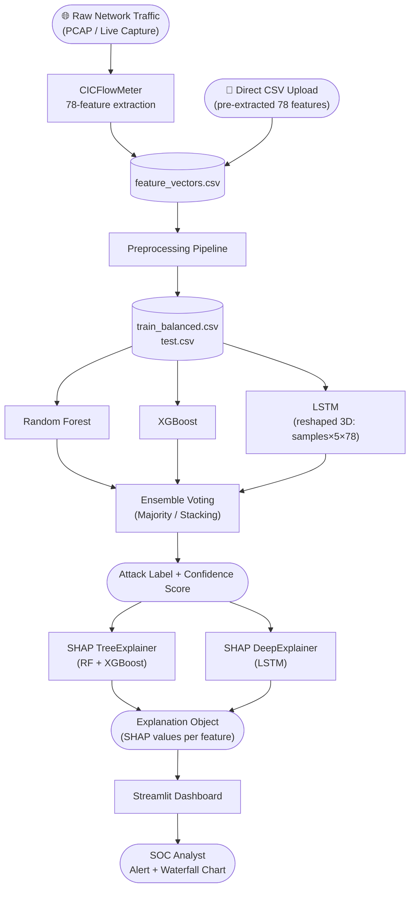
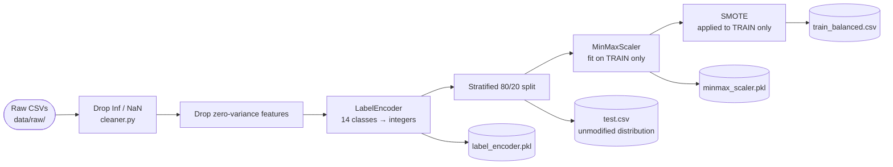
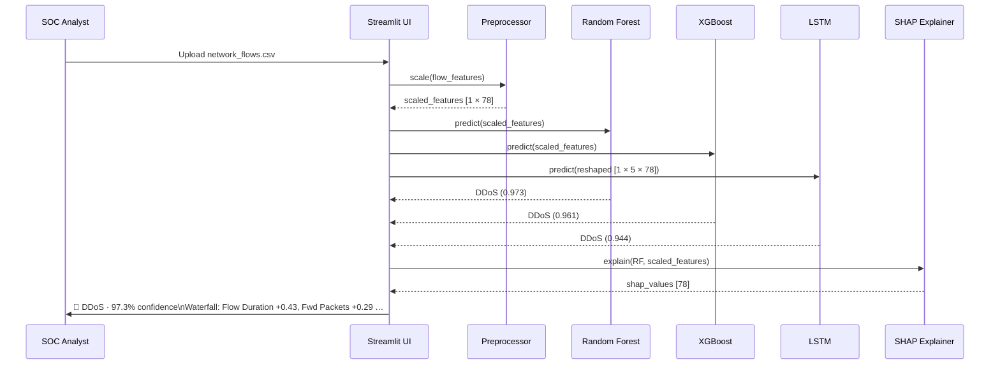
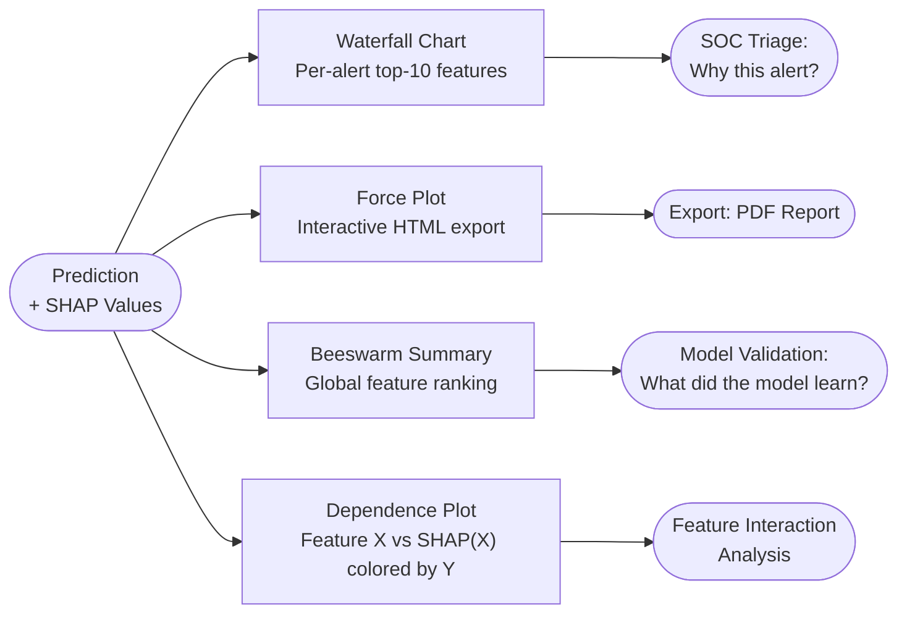
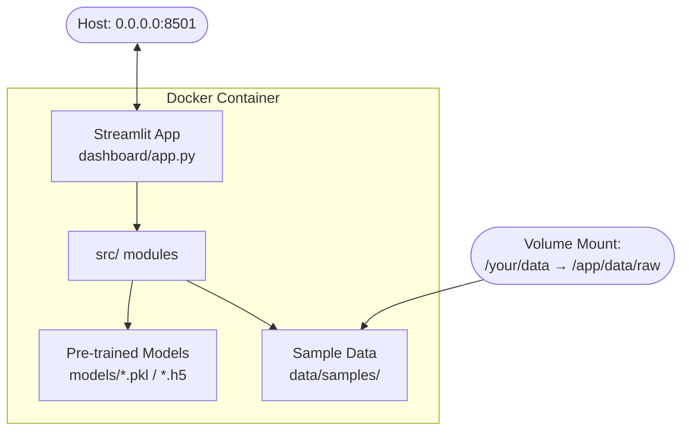

# End-to-End Data Flow

This document describes the complete data flow through the XAI-NIDS system — from raw network traffic to analyst-facing SHAP explanation — using Mermaid diagrams.

---

## 1. System-Level Data Flow

---

## 2. Preprocessing Sub-Flow

> **Data leakage guard:** The scaler and SMOTE are fitted exclusively on the training split. The test set reflects true real-world class distribution, including extreme imbalance (Infiltration: 36 samples).

---

## 3. Inference Flow (Single Network Flow)

---

## 4. SHAP Explanation Types

---

## 5. Deployment Architecture

**Container entry point:** `streamlit run dashboard/app.py --server.port 8501 --server.address 0.0.0.0`

---

## Data Artefacts Summary

| Artefact | Location | Produced By | Consumed By |
|----------|----------|-------------|-------------|
| `train_balanced.csv` | `data/processed/` | `02_preprocessing.ipynb` | `03_model_training.ipynb` |
| `test.csv` | `data/processed/` | `02_preprocessing.ipynb` | `03_model_training.ipynb`, `04_xai_shap.ipynb` |
| `minmax_scaler.pkl` | `data/processed/` | `02_preprocessing.ipynb` | Dashboard, CLI scripts |
| `label_encoder.pkl` | `data/processed/` | `02_preprocessing.ipynb` | Dashboard, CLI scripts |
| `random_forest.pkl` | `models/` | `03_model_training.ipynb` | `04_xai_shap.ipynb`, Dashboard |
| `xgboost_model.pkl` | `models/` | `03_model_training.ipynb` | `04_xai_shap.ipynb`, Dashboard |
| `lstm_model.h5` | `models/` | `03_model_training.ipynb` | `04_xai_shap.ipynb`, Dashboard |
| `feature_cols.json` | `data/processed/` | `02_preprocessing.ipynb` | All downstream modules |
| `label_map.json` | `data/processed/` | `02_preprocessing.ipynb` | Dashboard, SHAP visualisations |
