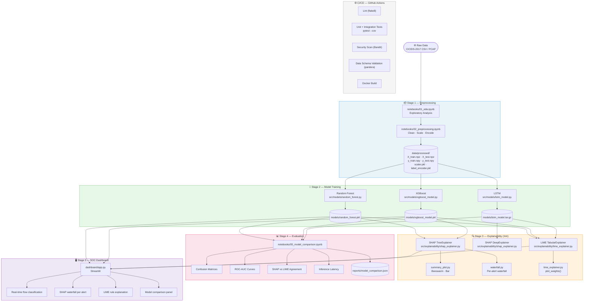
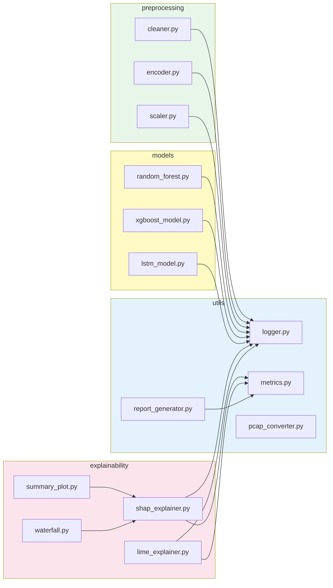

# Pipeline Diagram

This file contains the Mermaid source for the full XAI-NIDS pipeline.
GitHub renders Mermaid diagrams natively in Markdown — open this file on GitHub to see the interactive diagram.

---

## Full Pipeline (Data → Models → XAI → Dashboard)



---

## Module Dependency Graph



---

## Data Schema

```mermaid
erDiagram
    RAW_CSV {
        string Label
        float  Flow_Duration
        float  Total_Fwd_Packets
        float  Total_Backward_Packets
        float  Flow_Bytes_per_s
        float  Flow_IAT_Mean
        string "... 73 more features"
    }

    PROCESSED {
        npz    X_train
        npz    X_test
        npy    y_train
        npy    y_test
        pkl    scaler
        pkl    label_encoder
        json   feature_names
    }

    MODELS {
        pkl    random_forest
        pkl    xgboost_model
        targz  lstm_model
        json   label_map
        json   metrics_summary
    }

    REPORTS {
        json   model_comparison
        png    confusion_matrices
        png    roc_curves
        png    shap_vs_lime
        png    latency_benchmark
    }

    RAW_CSV ||--o{ PROCESSED : "preprocessing"
    PROCESSED ||--|{ MODELS : "training"
    MODELS ||--|{ REPORTS : "evaluation"
```
